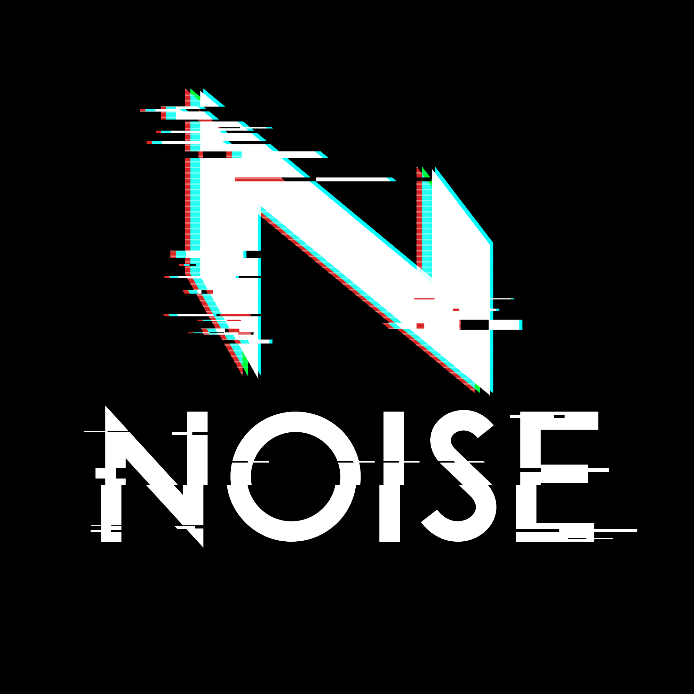
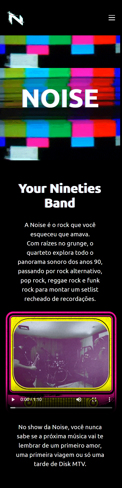
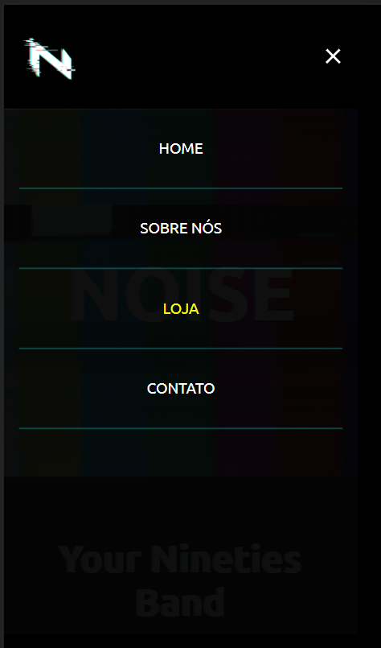
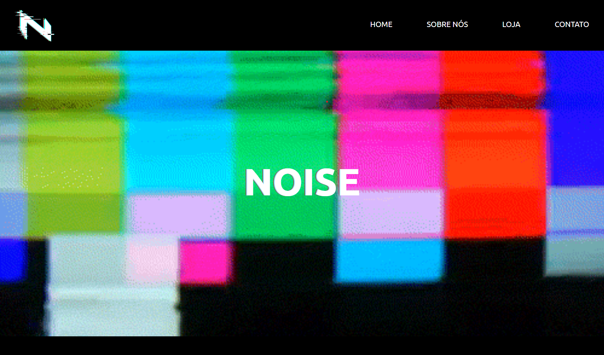

# Banda Noise

## 💻 Sobre o projeto

Este é um projeto pessoal de front-end criado para estudo, inspirado na banda Noise. 

🎸O objetivo é criar uma experiência nostálgica e imersiva para os fãs da música dos anos 90, inspirada pelo estilo único e vibrante da MTV naquela década.

📱O site é responsivo, adaptando-se a diferentes tamanhos de tela, desde dispositivos móveis até desktops. Ele utiliza técnicas de layout, como Flexbox, para criar uma estrutura flexível e organizada. Além disso, são aplicados efeitos de parallax para adicionar um aspecto visualmente interessante às páginas. No mobile, é utilizado o menu estilo hambúrguer, proporcionando uma navegação intuitiva.

📺 Também foram realizadas manipulações nas imagens do projeto para criar uma estética mais atraente e condizente com a temática, proporcionando uma experiência visual autêntica.

[Clique aqui para acessar](https://clarodriguess.github.io/banda-noise)

## 🎨 Layout
🖌️ Design criado no Figma

>Mobile
  
  
  

>Web

  
  

## 🛠 Tecnologias
- HTML5
- CSS3
- JavaScript

## 📬 Contato

[Linkedin](https://www.linkedin.com/in/clarissee-rodriguess/)

clarissebleasby@gmail.com
